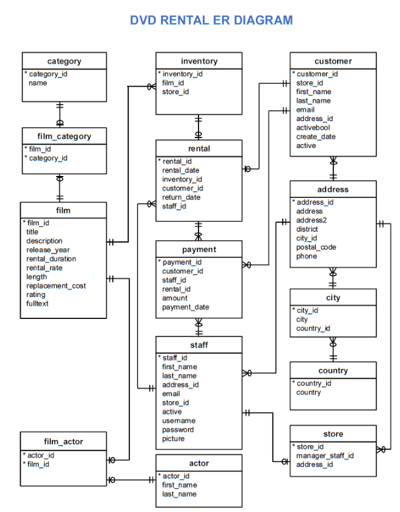

# Building a Power BI Report for Waggle

## Table of Contents
 * [Overview](#overiew)
 * [Introduction](#business-requests)
 * [Database Diagram](#database-diagram)
 * [Questions](#questions)
 * [Results](#results)
 * [Acknowledgements](#acknowledgements)

### Overview

In this project, we used SQL to explore a database related to movie rentals. We wrote SQL code to run SQL queries and answer interesting questions about the database. 

### Introdution

We queried the Sakila DVD Rental database. The Sakila Database holds information about a company that rents movie DVDs. 

### Database Diagram

#### Questions:

Question 1

We want to understand more about the movies that families are watching. The following categories are considered family movies: Animation, Children, Classics, Comedy, Family and Music.

Question 2

Now we need to know how the length of rental duration of these family-friendly movies compares to the duration that all movies are rented for. Can you provide a table with the movie titles and divide them into 4 levels (first_quarter, second_quarter, third_quarter, and final_quarter) based on the quartiles (25%, 50%, 75%) of the average rental duration(in the number of days) for movies across all categories? Make sure to also indicate the category that these family-friendly movies fall into.

Question 3

Finally, provide a table with the family-friendly film category, each of the quartiles, and the corresponding count of movies within each combination of film category for each corresponding rental duration category. The resulting table should have three columns:

- Category
- Rental length category
- Count
### Results

see `queries.sql`

### Acknowledgements

- udacity for providing this project.
- my employer for giving me the time to upskill.
