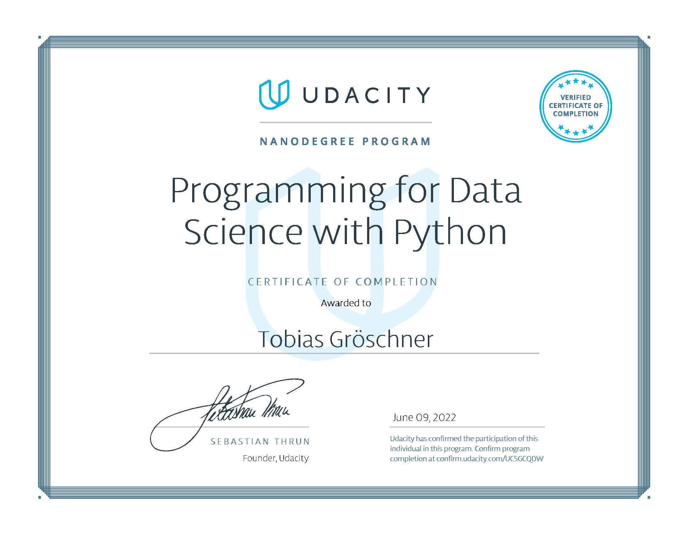

# Udacity's Programming for Data Science with Python

This repository is for projects of Udacity's nanodegree [Programming for Data Science with Python](https://www.udacity.com/course/programming-for-data-science-nanodegree--nd104) that covers SQL, git and basic Python. The course is beginner-level and takes approximately 3 months to complete. Only Project 1 will be shown.

## Nanodegree Projects

| Project No. | Project |
| ---		  | ----    |
| 01 		  | [Investigate a Relational Database](/Project-1/) 								|

## Nanodegree Certificate

